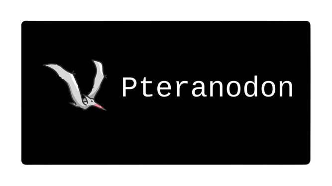

<p align="center">
  
</p>

# Pteranodon
Pteranodon is a modern client panel originally made for ServerDeploy, it is made with simplicity and minimality for the best user quality.

# Tech Stack
Made with: <br />
1. Astro (https://astro.build)
2. Tailwind (https://tailwindcss.com)
3. Javascript

# Guide
To get started to use Pteranodon, run ```git clone https://github.com/arkseek/pteranodon.git``` in the console <br />
run ```cd pteranodon```<br />
rename the .env.example file to .env <br />
sign up at https://supabase.com <br />
create an organization and get your SupaBase URL and ANON key. <br />
run ```npm i``` to install all NPM Packages <br />
then finally run ```npm run dev``` to open it up.

# Disclaimer
this panel is not finished, not recommended for use.
